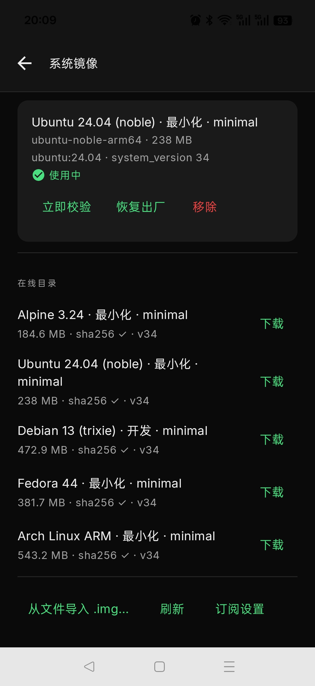
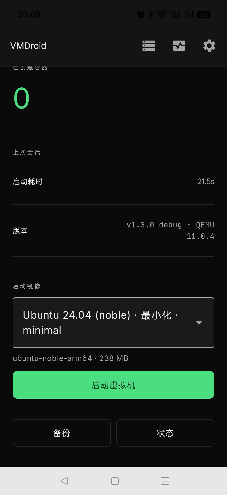
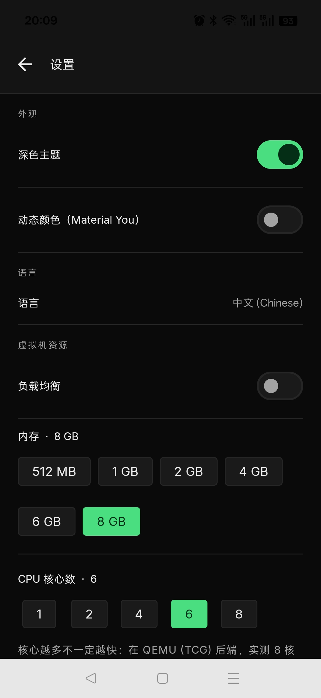
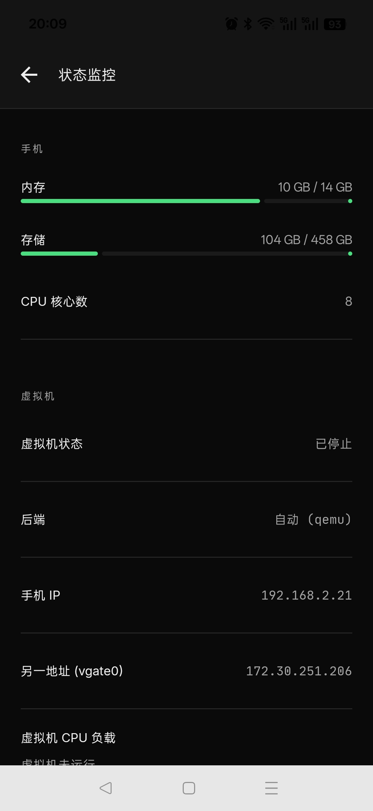

# VMDroid   (default password: 123)

**An Android VM with the software and the OS separated** — the VM is a standalone app,
the system is a swappable `.img` file.

> **Language**: the **Chinese** documentation ([README.md](README.md)) is the
> **primary** source. This English README is a **secondary** translation and may
> lag behind. If the two ever disagree, **the Chinese version wins**.

Specs & design: [docs/DESIGN.md](docs/DESIGN.md) · image format: [docs/IMAGE-FORMAT.md](docs/IMAGE-FORMAT.md) · review protocol: [docs/REVIEW.md](docs/REVIEW.md) ·
testing & fixes: [docs/TESTPLAN-system-images.md](docs/TESTPLAN-system-images.md) / [docs/FIXLIST-system-images.md](docs/FIXLIST-system-images.md)

**Download**: [APK release `v1.3.0`](https://github.com/ltbkq/vmdroid/releases/tag/v1.3.0) · [system images `system-images-2026.10.08`](https://github.com/ltbkq/vmdroid/releases/tag/system-images-2026.10.08)

## Purpose

1. **Software and system separated** — the VMDroid APK (**v1.3.0**, ≈47 MB) contains only the VM
   (engines, kernel, initrd, terminal, VNC, bridge) and **no distro rootfs at all**.
2. **The system is swappable** — the OS is one standalone `.img` file. Changing the OS means
   changing the file: no app reinstall, no code change. New systems ship as **images only;
   the app never needs an update**.

```
┌────────── VMDroid APK (v1.3.0 · ≈47 MB) ────┐      ┌─── system image .img (185–543 MB) ─┐
│ VM engines (QEMU/AVF) │ kernel+initrd │ UI    │      │ rootfs.squashfs     → vdb (ro)      │
│ terminal/VNC/USB/bridge │ ★image manager     │ ───▶ │ + kernel/initrd → boots on PC       │
└──────────────────────────────────────────────┘      │ + manifest + checksums (trailer)    │
                                                      └─────────────────────────────────────┘
```

## Quick start

1. Install the APK: release [`v1.3.0`](https://github.com/ltbkq/vmdroid/releases/tag/v1.3.0) → `vmdroid-1.3.0-debug.apk`
   (package `io.github.ltbkq.vmdroid.debug`, `versionCode 34`, bundled QEMU 11.0.4).
2. Open the **Images** page: the catalog lists the 5 images below (`catalog.json` + `catalog.json.sig`,
   **ECDSA P-256 verified — a bad signature refuses to load**) → download or **import from file** → activate.
3. Tap **Start VM**, wait for **Ready!**, then use the built-in terminal or SSH:
   `root` / `123`, `ltbkq` / `123` (passwordless sudo); guest port 22, host 9922.
4. Verify an image without installing: on a Linux PC `tools/pc-run.sh ` reaches `Ready!` in one command.

## Screenshots

| Images page | Home (boot-image selector) |
|---|---|
|  |  |

| Settings (VM resources) | Status monitor |
|---|---|
|  |  |

## Published system images (release `system-images-2026.10.08`)

| `image_id` | Asset | Size | Package mgmt | Dev toolchain | PC `Ready!` |
|---|---|---|---|---|---|
| `alpine-3.24-arm64` | [`alpine-minimal.img`](https://github.com/ltbkq/vmdroid/releases/download/system-images-2026.10.08/alpine-minimal.img) | 184,557,568 B | apk | — | 29.7s |
| `ubuntu-noble-arm64` | [`ubuntu-minimal.img`](https://github.com/ltbkq/vmdroid/releases/download/system-images-2026.10.08/ubuntu-minimal.img) | 238,034,944 B | apt/dpkg | — | 55.3s |
| `debian-minimal-arm64` | [`debian-arm64-build1225.img`](https://github.com/ltbkq/vmdroid/releases/download/system-images-2026.10.08/debian-arm64-build1225.img) | 472,915,968 B | apt/dpkg | gcc/g++/make/git | 83.0s |
| `fedora-44-arm64` | [`fedora-minimal.img`](https://github.com/ltbkq/vmdroid/releases/download/system-images-2026.10.08/fedora-minimal.img) | 381,689,856 B | dnf/rpm | gcc/g++/make/git | 146.8s |
| `arch-rolling-arm64` | [`arch-minimal.img`](https://github.com/ltbkq/vmdroid/releases/download/system-images-2026.10.08/arch-minimal.img) | 543,170,560 B | pacman | — | 67.9s |

> Times are measured on a PC (`qemu-system-aarch64`) until `Ready!`; all five images pass
> the PC smoke test, SSH login and the boot-contract markers.

| Item | Spec |
|---|---|
| Contents | systemd/OpenRC + networking + SSH + **Xvnc/pulseaudio (X11 & audio contract)**; **no** desktop environment / container stack preinstalled (debian & fedora add a dev toolchain; the rest install via `apt/dnf/pacman/apk`) |
| SSH | guest listens on **default port 22** (chain: `adb forward tcp:9922 tcp:9922` → phone `:9922` → guest `:22`) |
| Accounts | `root` / pw `123`, **`ltbkq` / pw `123` (passwordless sudo)** — both log in over SSH |
| Acceptance | `tools/pc-run.sh --smoke ` polls the console for `Ready!` and logs in with both accounts; on-device uses `tools/boot-test.sh` |
| Get the OS | in-app catalog **download** (resume + sha256) · or **import from file** — **`.img` only** (wrap other formats with `mkimg.sh`) |
| First run | No image → **setup wizard** (download/import), start button hidden; never boots a mount-failed zombie (see [DESIGN §8.4](docs/DESIGN.md)) |
| **PC boot** | `.img` ships kernel+initrd; on a Linux PC `tools/pc-run.sh ` reaches `Ready!` in one command (deps: `apt install qemu-system-arm python3 e2fsprogs ssh sshpass`) |
| Boot image | a **boot-image selector** on the Home screen switches installed `.img` files (see [DESIGN §8.2](docs/DESIGN.md)) |
| Factory reset | Zeros `storage.img`; the guest re-creates it on next boot (no seed needed, [DESIGN §4.3](docs/DESIGN.md)) |
| Diagnostics | **Boot history is preserved** (`boots/` archive + stage timings + failure reason), one-tap diagnostic export (see [DESIGN §16](docs/DESIGN.md)) |

Images sharing an `identity` (e.g. `debian:trixie`) switch **without** resetting the data disk;
a cross-distro switch asks for a one-time reset.

**Catalog & signing**: `catalog.json` + `catalog.json.sig` (ECDSA P-256 + SHA-256 over the raw bytes),
the public key is baked into the APK (`res/raw/catalog_pub.pem`) and a failed verification refuses to
load; regenerate with `distro-build/mkcatalog.sh`.
**Size**: since 2026-10-08 the ≤150 MB target is no longer a hard constraint (see
`docs/reviews/IMPLEMENTATION-NOTES.md`); only `fedora-minimal.img` keeps a **≤500 MB** hard check.

## Build & test

```sh
git clone https://github.com/ltbkq/vmdroid.git && cd vmdroid
./build-all.sh apk        # full kernel / initrd / QEMU / APK build (Docker + Android SDK/NDK)
./local-test.sh smoke     # local loop: build → install → boot → screenshots & logs (emulator or device)
```

Regression suites (release gate):

| Suite | Result |
|---|---|
| `./gradlew testDebugUnitTest` | 564 tests / 0 failures |
| `java -jar codec-selftest/out/selftest.jar` | 47/47 |
| `java -jar systemimage-selftest/out/selftest.jar` | 56/56 |
| `tools/selftest.sh` (imgboot library) | 64/64 |
| PC smoke for all 5 images `tools/pc-run.sh --smoke ` | 5/5 passed |

## Repository layout

A single branch `master` (merged 2026-10-09 from the former docs-only `master` and the `app` code branch):

```
app/                    application modules (Kotlin/Compose)
terminal-emulator/      terminal engine (vendored Termux)
terminal-view/          terminal UI
docs/                   DESIGN · IMAGE-FORMAT · REVIEW · reviews/ · TESTPLAN · FIXLIST · guide/ · screenshots/
tools/                  pc-run.sh (PC boot) · selftest.sh (boot-library self-test) · lib/
codec-selftest/         image codec + BootGuard/reset decision-table self-test
systemimage-selftest/   import/verify/rotation/rollback E2E self-test
build-all.sh            full kernel / initrd / QEMU / APK build
local-test.sh           local "build → install → boot → capture" loop
```

The images themselves are produced by a local `distro-build/` pipeline (not in the repo) and
published as release assets.

## Relationship to upstream

- VM functionality **mirrors [ExTV/Podroid](https://github.com/ExTV/Podroid)** (GPLv2) 1:1:
  `VmEngine` / `QemuEngine` / `AvfEngine`, socket layout, boot contract, host bridge,
  terminal, VNC, USB passthrough are all kept; only "where the OS comes from" becomes an image manager.
- System images are built by the local pipeline and published in **this repo's Releases**;
  [`ltbkq/Podroid-Debian`](https://github.com/ltbkq/Podroid-Debian) remains as the Debian build reference.
- License: GPL-2.0-or-later (inherited from upstream).

## Status

| Stage | Scope | Status |
|---|---|---|
| M0 | Design review (R1–R4) + P0 spike | ✅ done |
| M1 | Fork upstream → rename/packages → drop rootfs assets | ✅ done (installable, Home four states + `§16` logging) |
| M2 | `.img` codec + `mkimg.sh` + `pc-run.sh` + account spec | ✅ done (5 images built and PC-smoke tested) |
| M3 | Image management: import/verify/activate/delete/BootGuard + boot-image selector | ✅ done (`systemimage-selftest` 56/56 covers §13.2) |
| M4 | Catalog + resumable download + notifications + Images page | ✅ done (signature chain closed 2026-10-09) |
| M5 | Factory reset (zero + rebuild `storage.img`) | ✅ implemented (Images page), dedicated regression pending |
| M6 | On-device dual-backend regression + diagnostics UI + four-state audit | 🔄 in progress (local suites green; device matrix pending) |
| M7 | Releases, signing, catalog + `.sig`, docs | ✅ mostly done (`v1.3.0` published; CI pending) |

See [docs/DESIGN.md §14](docs/DESIGN.md).

> This English file is the **secondary** translation — update [README.md](README.md) first, then sync here.
